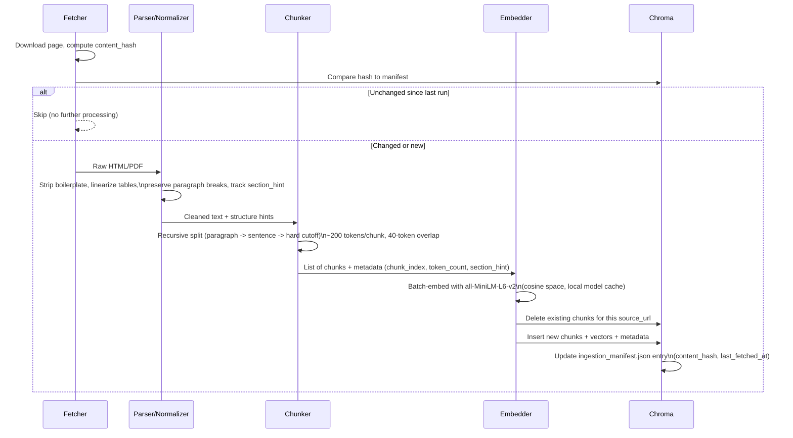

# Ingestion Architecture — Parsing, Chunking & Embedding

Companion to [RAG-Architecture.md](./RAG-Architecture.md) §5 ("Ingestion Pipeline"), which describes the pipeline at a high level. This document drills into exactly how **parsing, chunking, and embedding** work, step by step, since those stages determine retrieval and citation quality.

> **Status:** Chunking strategy confirmed by user on 2026-09-06. Specific numeric parameters and library choices below are **proposed defaults with stated rationale** — flagged explicitly where they still need your confirmation (§7). Nothing here should be read as decided unless it says "confirmed."

---

## 1. Inputs This Stage Handles

Per [RAG-Architecture.md §2](./RAG-Architecture.md#2-corpus-scope-confirmed-2026-09-05), today's corpus is 7 Groww pages (HTML, structured "fact-card" style — expense ratio, exit load, min SIP, riskometer, benchmark, AUM, holdings, etc.), with more pages still to be added to reach 15–25 (likely mixing in AMFI/SEBI guidance pages and possibly AMC PDF documents — KIM/SID/factsheet — once §12 item 1 of the main doc is resolved). This pipeline is designed to handle **both HTML and PDF** inputs, and both **structured fact-card content and long-form prose**, since the corpus will likely contain both before it's done.

---

## 2. Confirmed Chunking Strategy: Generic Fixed-Size Chunking

**Confirmed 2026-09-06:** chunking uses **generic fixed-size chunking** uniformly across all source types — including the structured Groww fact-card pages — rather than a field-level extractor that parses "Expense Ratio: 0.98%" into its own dedicated chunk, or a hybrid of the two. This was an explicit choice over field-level/hybrid alternatives, in favor of one simpler, reusable method that doesn't need a bespoke parser per source-page layout.

**Known trade-off of this choice (documented, not silently absorbed):** because facts aren't extracted field-by-field, a fixed-size text window can occasionally split a label from its value (e.g. "Expense Ratio" ends one chunk, "0.98%" starts the next) or mix two unrelated facts into one chunk, which can reduce citation precision for very short factual queries. §3.3's boundary-aware splitting and §3.2's table linearization are mitigations within the generic approach, not a reversal of it.

---

## 3. Stage-by-Stage Detail

### 3.1 Fetch (recap — full detail in main doc §5)

HTTP GET (HTML) or PDF download per source URL, cached to `data/raw/` (gitignored, CI-only per [RAG-Architecture.md §8](./RAG-Architecture.md#8-scheduler--github-actions-daily-live-data-refresh)), content-hashed for change detection.

### 3.2 Parse & Normalize

**Proposed (needs confirmation — §7):**

| Input type | Proposed library | Why |
|---|---|---|
| HTML | `BeautifulSoup4` + `lxml` parser | Well-established, sufficient for Groww's page structure; easy to target the main content region and strip `<nav>`, `<script>`, `<style>`, ads/footers. |
| PDF (future KIM/SID/factsheet) | `pdfplumber` | Reasonable text extraction *and* table extraction in one library, which matters for factsheet tables (expense ratio, load structure, holdings). |

**Normalization steps:**
1. Strip navigation, scripts, styles, ad blocks, and footer boilerplate.
2. Preserve paragraph/section boundaries (e.g. keep `\n\n` between block-level elements) — needed by the boundary-aware chunker in §3.3.
3. **Table linearization:** any HTML/PDF table is converted to a line-per-row text format (`"<row header>: <col1 header>=<col1 value>, <col2 header>=<col2 value>"`) before chunking, rather than being flattened into unstructured run-on text. This is a *parsing/normalization* step, not field-level extraction — it doesn't create per-fact chunks, it just prevents a table from turning into unreadable jumbled text inside a generic chunk. This directly addresses a gap identified when comparing against a reference architecture (naive text extraction badly mangles tabular data).
4. Normalize encoding to UTF-8; replace/drop undecodable bytes rather than failing the whole page.
5. Track a lightweight "nearest preceding heading" as the parse proceeds, to attach as a `section_hint` metadata field (best-effort; not always available on Groww's layout).

### 3.3 Chunking

**Hard constraint (fact, not a preference):** the confirmed embedding model, `all-MiniLM-L6-v2`, has a **maximum sequence length of 256 tokens**. Anything longer is silently truncated by the model — the excess text is embedded as if it didn't exist, with no error raised. This caps how large a chunk can safely be, regardless of chunking strategy.

**Proposed parameters (needs confirmation — §7):**
- **Chunk size: 200 tokens.** Leaves headroom under the 256-token ceiling for the model's special tokens (`[CLS]`/`[SEP]`) and wordpiece subword expansion (a "token" here means the actual BERT/MiniLM wordpiece tokenizer's count, not a rough word count — see below).
- **Overlap: 40 tokens (20%)** — keeps context continuity across chunk boundaries without excessive duplication in a small corpus.
- **Minimum chunk threshold: ~20 tokens.** A trailing fragment shorter than this is merged into the previous chunk rather than stored as its own near-empty, low-signal chunk.

**Tokenizer used for counting:** the same tokenizer the embedding model itself uses (`sentence-transformers`' underlying `AutoTokenizer` for `all-MiniLM-L6-v2`), not a generic word-count approximation — so the 256-token limit is measured exactly as the model will see it, not estimated.

**Splitting algorithm (boundary-aware, still "generic" — no field/label logic):**
1. Try splitting on paragraph breaks first.
2. If a paragraph exceeds 200 tokens, split on sentence boundaries within it.
3. If a single sentence still exceeds 200 tokens (rare — e.g. a long comma-separated disclosure sentence), fall back to a hard token-count cutoff.
4. Apply the 40-token overlap by carrying the tail of chunk *N* into the start of chunk *N+1*.

This keeps the method uniform and generic per §2, while avoiding the worst version of "mid-word, mid-number" cuts a naive fixed-character splitter would produce.

### 3.4 Chunk Metadata

Extends the schema in [RAG-Architecture.md §9](./RAG-Architecture.md#9-chunk-metadata-schema-chroma) with ingestion-specific fields:

| Field | Example | Purpose |
|---|---|---|
| `source_url` | `https://groww.in/mutual-funds/bajaj-finserv-flexi-cap-fund-direct-growth` | Citation link (from main schema). |
| `doc_type` | `groww_summary` | From main schema. |
| `scheme_name` / `amc_name` | `Bajaj Finserv Flexi Cap Fund` / `Bajaj Finserv Mutual Fund` | From main schema. |
| `last_fetched_at` | `2026-09-06` | From main schema. |
| `chunk_index` | `3` | Position of this chunk within its source document (0-based). |
| `token_count` | `187` | Actual token count per the model tokenizer; useful for debugging retrieval quality. |
| `section_hint` | `"Fund Objective"` or `null` | Best-effort nearest preceding heading, when parseable. |
| `chunk_id` | `sha256(source_url + "|" + chunk_index + "|" + content_hash)[:16]` | Stable, content-aware ID (see §3.6 for why content_hash is included). |

### 3.5 Embedding

- **Model (confirmed):** `all-MiniLM-L6-v2` via `sentence-transformers`, 384-dimension output vectors.
- **Similarity metric (proposed — §7):** cosine similarity. Chroma's default HNSW space is L2; since `all-MiniLM-L6-v2` is trained/commonly used with cosine similarity, the Chroma collection should be created with `metadata={"hnsw:space": "cosine"}` explicitly rather than left at Chroma's default.
- **Batching:** embed in batches (proposed batch size: 32) rather than one chunk at a time — meaningfully faster even on CPU, which is what both local dev and GitHub Actions runners use (no GPU assumed).
- **Model weight cache — a non-obvious storage-rule fix needed:** `sentence-transformers` downloads model weights to a default cache directory in the OS user-profile (e.g. `~/.cache/torch/sentence_transformers` or the Hugging Face cache), **outside the project folder** — this would silently violate the "everything inside `RAG Chatbot`" storage rule if left at its default. **Fix:** explicitly set the cache location inside the project (e.g. `cache_folder="./.model_cache/"` in the `SentenceTransformer(...)` constructor, or the `SENTENCE_TRANSFORMERS_HOME` environment variable) so model weights land inside the project folder, not the user's home directory. This cache folder should be **gitignored** (model weights are ~90MB — binary, not meant for git history); GitHub Actions will re-download the model each run unless a `actions/cache` step is added later as an optimization (not required for correctness).

### 3.6 Write / Upsert to Chroma

- **On an unchanged source** (per the manifest content-hash check in [RAG-Architecture.md §5](./RAG-Architecture.md#5-ingestion-pipeline-data--vector-store)): skip entirely — no re-chunking, no re-embedding.
- **On a changed source:** **delete all existing chunks where `source_url` matches**, then insert the freshly parsed/chunked/embedded set as new records. This is deliberately a *delete-and-reinsert per source*, not a per-chunk upsert — because when a page's content changes, chunk boundaries can shift entirely (a chunk that was `chunk_index=3` yesterday may not correspond to the same text today), so trying to diff and upsert individual chunk IDs would be fragile. Delete-then-reinsert for that `source_url` is simpler and correct. This is why `chunk_id` incorporates `content_hash` (§3.4) — old chunks from a prior version of the page never collide with or shadow the new ones.

---

## 4. Sequence Diagram (Single Source, One Ingestion Run)

---

## 5. Edge Cases & Failure Handling

- **Empty or near-empty page after parsing** (e.g. a page that fails to render meaningful content) — log and skip; do not create a lone near-empty chunk that could surface as a low-quality citation.
- **A single sentence/field longer than 200 tokens** (unlikely on fact-cards, more plausible in FAQ prose or long disclosure sentences) — falls back to the hard token-count cutoff in §3.3, accepting a mid-sentence cut in that rare case rather than exceeding the model's 256-token limit.
- **Encoding issues** in fetched HTML/PDF — normalize to UTF-8, replacing undecodable bytes rather than failing the entire source.
- **Duplicate content across two source URLs** (e.g. an identical FAQ answer linked from more than one scheme page) — **not deduplicated in this design.** Each `source_url` gets its own independently chunked/embedded copy, even if content overlaps with another source. This is an accepted simplification for a small, curated corpus — flagged here rather than silently assumed away.
- **PDF table extraction failures** (e.g. a malformed or image-based table in a KIM/SID PDF) — falls back to plain text extraction for that page/section rather than failing the whole document; the table linearization benefit (§3.2) is simply lost for that specific table.

---

## 6. What's Confirmed vs. Still Open

**Confirmed (2026-09-06):**
- Chunking strategy: generic fixed-size chunking, applied uniformly (§2).
- Embedding model: `all-MiniLM-L6-v2` (from [RAG-Architecture.md §1](./RAG-Architecture.md#1-confirmed-technology-stack)).
- Delete-and-reinsert-per-source on change, rather than per-chunk upsert (§3.6).

**Proposed defaults — needs your confirmation before implementation:**
1. HTML parser: `BeautifulSoup4` + `lxml`.
2. PDF parser (for future non-HTML sources): `pdfplumber`.
3. Chunk size: 200 tokens; overlap: 40 tokens (20%); minimum chunk threshold: ~20 tokens.
4. Chroma similarity space: cosine (`hnsw:space: "cosine"`) instead of Chroma's L2 default.
5. Embedding batch size: 32.
6. Model cache location inside the project folder (exact path, e.g. `./.model_cache/`) and whether to gitignore it (recommended: yes).
7. No cross-source deduplication in v1 (§5) — confirm this is acceptable for now.

---

## 7. Open Questions Carried Over from the Main Architecture

These remain open regardless of this document (see [RAG-Architecture.md §12](./RAG-Architecture.md#12-open-decisions-requiring-your-confirmation)) but directly affect this pipeline once resolved:
- Remaining source pages (AMFI/SEBI + additional AMC docs) will introduce PDF and longer-prose inputs that exercise the PDF-parsing and sentence-splitting paths described here more heavily than the current all-HTML, fact-card corpus does.
