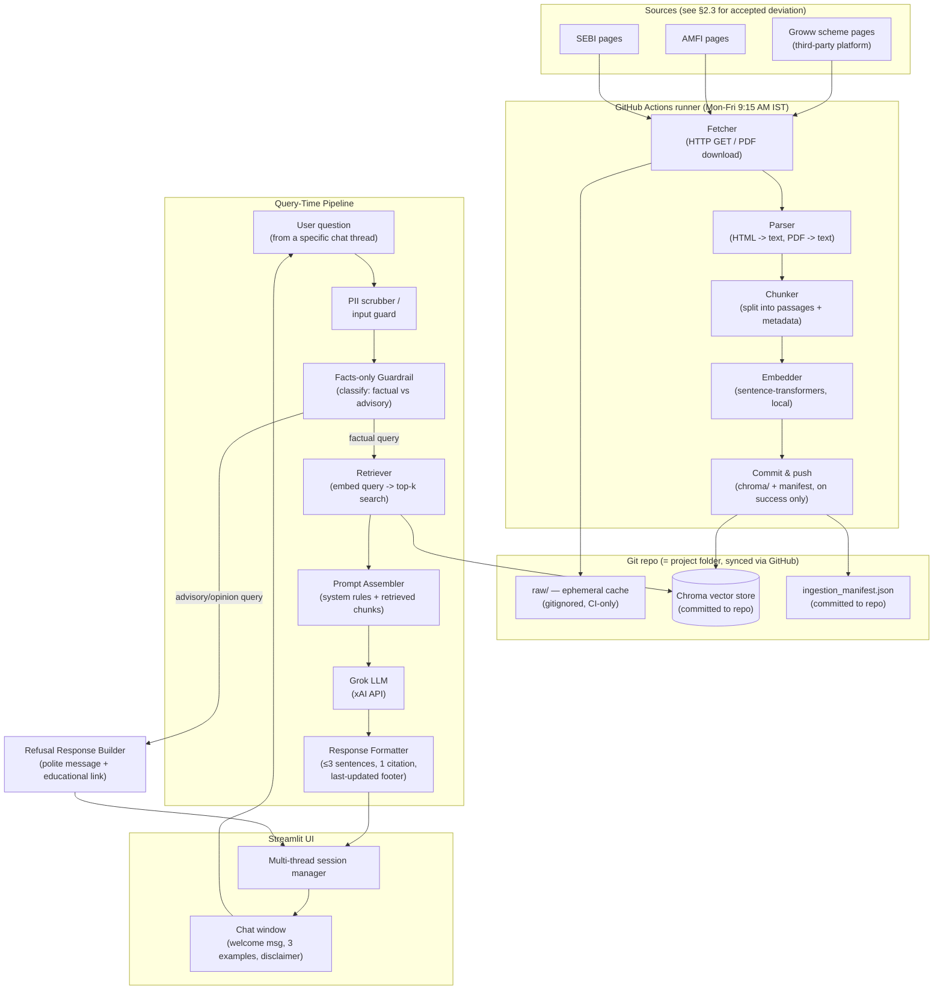

# RAG Architecture

Companion document to [Problem-Statement.md](./Problem-Statement.md). Describes the technical architecture for the Mutual Fund FAQ Assistant (facts-only, Groww reference context).

> **Status of decisions below:** Confirmed by user on 2026-09-05 for the purpose of drafting this architecture. User has noted these may change later — no component here should be treated as locked in; re-confirm before implementation if time has passed or requirements shift.

---

## 1. Confirmed Technology Stack

| Layer | Choice | Notes |
|---|---|---|
| Language / runtime | **Python** | Chosen to keep Streamlit + Chroma + local embeddings in one ecosystem. |
| LLM (answer generation) | **Grok (xAI API)** | OpenAI-compatible REST API; called via HTTPS with an xAI API key. |
| Embeddings | **Local sentence-transformers** (`all-MiniLM-L6-v2`) | Runs offline, no API key, no cost. This is Chroma's default embedding function. |
| Vector store | **Chroma** (local, embedded/persistent mode) | Runs in-process, persists to a local folder — no external server. |
| UI | **Streamlit** | Must support multiple independent, simultaneous chat threads (see §9). |
| Scheduler | **GitHub Actions**, cron `45 3 * * 1-5` UTC (= Mon–Fri 9:15 AM IST) | Runs on GitHub's cloud runners — see §8 for the explicit, user-accepted exception to the local-folder-only storage rule this requires. |
| Version control | **Git + GitHub remote** (required by GitHub Actions) | Project is not yet a git repo — this must be set up before the workflow can run; needs separate confirmation before executing (§12). |
| Storage location | **Entirely inside the `RAG Chatbot` project folder**, with GitHub Actions as an explicit, scoped exception (§8) | No other external services, no OS temp directories, no cloud storage beyond that one exception. |

**Open / not yet decided** (flagged rather than assumed — see §12):
- Specific Grok model name/version
- Chunking parameters (chunk size / overlap)
- Hosting target for the Streamlit prototype (local only vs. deployed) — ideally one that auto-redeploys on git push, to stay in sync with the daily commit (§8)
- Remaining source pages needed to reach 15–25 total (see §2.3)
- Git repo initialization + GitHub remote creation — not yet done, needs your explicit go-ahead before I run any git/GitHub setup commands

---

## 2. Corpus Scope (Confirmed 2026-09-05)

### 2.1 AMC and Schemes

**AMC:** Bajaj Finserv Mutual Fund
**Schemes (7):**

| # | Scheme | Category |
|---|---|---|
| 1 | Bajaj Finserv Small Cap Fund | Small Cap |
| 2 | Bajaj Finserv Flexi Cap Fund | Flexi Cap |
| 3 | Bajaj Finserv Healthcare Fund | Sectoral/Thematic |
| 4 | Bajaj Finserv Multi Cap Fund | Multi Cap |
| 5 | Bajaj Finserv Large & Mid Cap Fund | Large & Mid Cap |
| 6 | Bajaj Finserv Balanced Advantage Fund | Hybrid |
| 7 | Bajaj Finserv ELSS Tax Saver Fund | ELSS |

### 2.2 Confirmed Source URLs (7 of the required 15–25)

| Scheme | URL |
|---|---|
| Small Cap Fund | https://groww.in/mutual-funds/bajaj-finserv-small-cap-fund-direct-growth |
| Flexi Cap Fund | https://groww.in/mutual-funds/bajaj-finserv-flexi-cap-fund-direct-growth |
| Healthcare Fund | https://groww.in/mutual-funds/bajaj-finserv-healthcare-fund-direct-growth |
| Multi Cap Fund | https://groww.in/mutual-funds/bajaj-finserv-multi-cap-fund-direct-growth |
| Large & Mid Cap Fund | https://groww.in/mutual-funds/bajaj-finserv-large-mid-cap-fund-direct-growth |
| Balanced Advantage Fund | https://groww.in/mutual-funds/bajaj-finserv-balanced-advantage-fund-direct-growth |
| ELSS Tax Saver Fund | https://groww.in/mutual-funds/bajaj-finserv-elss-tax-saver-fund-direct-growth |

### 2.3 Accepted Deviations from the Problem Statement (explicitly confirmed by user, not assumed)

1. **Source authority.** The problem statement requires *"official public sources (AMC, AMFI, SEBI)... no third-party blogs or aggregator websites."* All 7 confirmed URLs are `groww.in` pages — a third-party retail investment platform, not the AMC's own site (`bajajamc.com`), AMFI, or SEBI. A fetch of the Flexi Cap page confirmed Groww renders the data itself (expense ratio, exit load, SIP, riskometer, benchmark) and only links out to `bajajamc.com` for the SID — no direct AMFI/SEBI links. **User has explicitly accepted this as a deviation** rather than switching to official AMC/AMFI/SEBI pages. This should be called out plainly in the README's "known limits" section, since it's a deviation from the stated constraint.
2. **Scheme count.** Problem statement calls for 3–5 schemes; **7 schemes are in scope**, confirmed by user as an accepted expansion.
3. **Corpus depth still pending.** These 7 URLs are one Groww summary page per scheme. The problem statement calls for 15–25 pages total per corpus (factsheets, KIM, SID, FAQ, AMFI/SEBI guidance, statement/tax-doc guides). Additional pages are still needed to reach that range — not yet selected (see §12).

---

## 3. Design Principles (from the problem statement)

1. **Facts-only** — no advice, no opinions, no performance comparisons.
2. **Every answer cites exactly one source link.**
3. **Answers ≤ 3 sentences**, with a footer: `Last updated from sources: <date>`.
4. **Refuse advisory/opinion queries** politely, with a link to an educational (AMFI/SEBI) resource instead.
5. **No PII collection/storage** (PAN, Aadhaar, account numbers, OTPs, emails, phone numbers).
6. **Official sources only** — AMC, AMFI, SEBI. No blogs/aggregators. *(Note: §2.3 records an explicit, user-accepted deviation from this principle for the Groww source pages.)*
7. **Multiple independent chat threads** must be supported concurrently.

These principles are enforced at multiple layers (retrieval scope, prompt/system instructions, a guardrails/refusal layer, and UI-level display), not just by the LLM's own judgment — see §6.

---

## 4. High-Level Architecture



---

## 5. Ingestion Pipeline (Data → Vector Store)

Runs once initially to build the corpus, then re-runs on the daily schedule (§8). Steps 4–7 (parsing, chunking, embedding, upsert) are detailed in depth in [Ingestion-Architecture.md](./Ingestion-Architecture.md) — this section stays high-level.

1. **Source list** — the confirmed URLs in §2.2, plus additional pages still needed to reach 15–25 total (§12), stored as a config file (e.g. `Docs/sources.csv` or `data/sources.csv`).
2. **Fetcher** — downloads each URL (HTML or PDF). Stores a raw copy under a `raw/` cache folder inside the project (gitignored — regenerated fresh by each CI run, not committed), and computes a content hash.
3. **Change detection** — compares the new hash against `ingestion_manifest.json`. If unchanged since the last run, skips re-processing that source (keeps daily runs cheap).
4. **Parser** — extracts clean text from HTML (strip nav/ads/scripts) or PDF (text extraction), preserving scheme name, document type, and publish/effective date where available.
5. **Chunker** — splits parsed text into passages sized for retrieval (parameter TBD, typically a few hundred tokens with slight overlap), tagging each chunk with metadata (see §9).
6. **Embedder** — encodes each chunk with the local `all-MiniLM-L6-v2` sentence-transformer model.
7. **Upsert into Chroma** — writes/updates vectors + metadata into the persistent local Chroma collection, keyed by a stable chunk ID so re-ingestion updates rather than duplicates.
8. **Manifest update** — records `source_url -> {content_hash, last_fetched_at}` so the UI's "Last updated from sources" footer can reflect real fetch dates.
9. **Commit & push** — *only if the run completes successfully end-to-end*, the CI job commits the updated `data/chroma/` and `ingestion_manifest.json` back to the git repo and pushes. A failed/partial run pushes nothing, leaving the previous day's data live (§8).

---

## 6. Query-Time Pipeline

1. **Input guard (PII scrubber)** — the user's question is checked for PAN/Aadhaar/account-number/OTP/email/phone patterns before anything is processed or logged. If detected, the request is rejected with a message asking the user to remove personal data — it is never stored or forwarded to the LLM.
2. **Facts-only classifier (Guardrail)** — determines whether the query is a factual lookup (expense ratio, exit load, minimum SIP, lock-in, riskometer, benchmark, statement download, etc.) or an advisory/opinion request ("should I buy/sell", "which is better").
   - **Factual** → proceeds to retrieval.
   - **Advisory/opinion** → short-circuits to a refusal template (§7), never reaches the LLM with an "advice" framing.
3. **Retriever** — embeds the query with the same local embedding model, performs a top-k similarity search against Chroma (optionally metadata-filtered by scheme name if the query names one), returning the most relevant chunks plus their source URLs.
4. **Prompt Assembler** — builds the LLM prompt: a system instruction block encoding the design principles (§3) + the retrieved chunks (with their source URLs) + the user's question. The system instructions explicitly require: answer only from provided context, cite exactly one source, ≤3 sentences, refuse anything resembling advice even if asked indirectly.
5. **Grok LLM call** — sends the assembled prompt to the xAI API and receives the drafted answer.
6. **Response Formatter** — enforces the output contract in code (not just via the prompt): truncates/validates to ≤3 sentences, ensures exactly one citation link is present (falls back to the top retrieved source if the model omits it), appends `Last updated from sources: <date>` using the manifest's fetch date for the cited source.
7. **Thread manager** — appends the question/answer pair to the correct chat thread's history and renders it in the Streamlit UI.

---

## 7. Refusal Handling

When the Guardrail classifies a query as advisory/opinion-seeking, a fixed template is used instead of calling the LLM for a free-form answer (reduces risk of the model improvising advice):

```
I can only share verified facts from official sources — I'm not able to advise on
whether to buy, sell, or which fund is "better". For guidance on choosing between
funds, see AMFI's investor education resource: <AMFI/SEBI educational link>
```

The exact educational link can point to an AMFI or SEBI investor-education page (to be selected as part of corpus curation, §12).

---

## 8. Scheduler — GitHub Actions (Daily Live-Data Refresh)

**Confirmed (2026-09-05):** mechanism is **GitHub Actions**; schedule is **Monday–Friday at 9:15 AM IST** (matches NSE/BSE market open). No run on Saturday/Sunday.

### 8.1 Accepted exception to the storage rule

This project's storage rule is "everything inside the `RAG Chatbot` folder, no other storage or location." GitHub Actions runs the scheduled job on **GitHub's own cloud runners**, not on your machine — this is an explicit, user-accepted, narrowly-scoped exception (confirmed 2026-09-05), limited to *where the ingestion job executes*. The canonical data it produces still lives inside the project folder, because it's committed back into the same git repo (§8.3) — GitHub is the scheduler/compute, not a separate data store.

### 8.2 Workflow design

- **File:** `.github/workflows/daily-refresh.yml`
- **Trigger:** `schedule: cron: "45 3 * * 1-5"` (UTC; 9:15 AM IST = 3:45 AM UTC, no date-boundary shift) **+** `workflow_dispatch:` for on-demand manual runs (useful for testing/demoing).
- **Secrets required: none.** Fetching public pages and embedding locally (`all-MiniLM-L6-v2`) needs no API key. (The Grok API key is only used by the Streamlit app at query time — a separate concern, not part of this workflow.)
- **Concurrency guard:** a `concurrency:` group prevents two runs overlapping and racing on the same commit.
- **Steps:** checkout repo → set up Python → install deps → run the ingestion pipeline (§5) → if and only if it completes successfully, commit `data/chroma/` + `ingestion_manifest.json` and push.
- **Logging:** relies on GitHub Actions' own run logs (visible in the repo's Actions tab, ~90-day retention) as the primary record — no separate committed log file needed, avoiding daily log-commit noise.
- **Failure handling:** on any fetch/parse/embed error, the job does not commit or push — the repo (and therefore the app) keeps serving the last successfully ingested data, consistent with the "keep last good cache" rule in §5.

### 8.3 Why commit-back over Actions cache/artifacts

Actions runners are ephemeral — nothing persists between runs unless explicitly saved. Two ways to persist were considered:

| Option | Verdict |
|---|---|
| **Commit `data/chroma/` + manifest back to the git repo** | **Chosen.** Keeps the repo as the single source of truth (in line with the folder-only philosophy — GitHub is just doing the scheduling). Free audit trail via `git log`. At this corpus size (15–25 pages, a few hundred chunks) daily commits are tiny — no Git LFS needed. `data/raw/` (cached HTML/PDF) is gitignored and NOT committed — it's regenerated fresh each run and isn't needed for querying, so excluding it keeps repo growth minimal. |
| Actions cache / artifacts | Rejected — built for CI build-speedups and expire (cache eviction, ~90-day artifact expiry); not designed to be the durable state an app reads from continuously, and would require the app to call the GitHub API just to fetch its own data. |

### 8.4 Downstream implication

Whatever hosts the Streamlit app needs the latest commit to answer with fresh data — either it `git pull`s before/while serving, or (preferably) it's hosted somewhere that auto-redeploys on push to the repo. This connects directly to the still-open "hosting target" decision (§12).

---

## 9. Chunk Metadata Schema (Chroma)

Each vector stored in Chroma carries metadata used for citation, filtering, and freshness display:

| Field | Example | Purpose |
|---|---|---|
| `source_url` | `https://groww.in/mutual-funds/bajaj-finserv-flexi-cap-fund-direct-growth` | The single citation link shown in answers. |
| `doc_type` | `groww_summary` / `factsheet` / `KIM` / `SID` / `FAQ` / `AMFI` / `SEBI` | Helps route certain query types to the right doc type. |
| `scheme_name` | `Bajaj Finserv Flexi Cap Fund` | Enables per-scheme filtering when a query names a scheme. |
| `amc_name` | `Bajaj Finserv Mutual Fund` | Corpus-scope tagging. |
| `last_fetched_at` | `2026-09-05` | Drives the "Last updated from sources" footer. |
| `chunk_id` | stable hash of `source_url + chunk_index` | Idempotent upserts on re-ingestion. |

---

## 10. Multi-Thread Chat Support (Streamlit)

- Each chat thread is a distinct session object (thread ID, message history) held in Streamlit's session/app state, not shared across threads.
- The UI presents a thread selector/sidebar (new thread, switch between existing threads) alongside the active chat window.
- Retrieval and generation are stateless per-request (no cross-thread leakage of context); only the conversation history within a thread is used, if at all, for follow-up questions.
- The welcome message, 3 example questions, and the `"Facts-only. No investment advice."` disclaimer are shown at the top of every new thread.

---

## 11. Proposed Folder Structure

Everything stays inside the `RAG Chatbot` project folder (= the git repo root), per your storage constraint — GitHub Actions (§8.1) is the one scoped exception, for compute only.

```
RAG Chatbot/
├── .github/
│   └── workflows/
│       └── daily-refresh.yml               (GitHub Actions: Mon-Fri 9:15 AM IST cron, §8)
├── .gitignore                               (excludes data/raw/, local secrets/.env)
├── Docs/
│   ├── Problem-Statement.md
│   ├── RAG-Architecture.md               (this file)
│   ├── Ingestion-Architecture.md          (chunking/embedding detail)
│   └── sources.csv                        (15–25 corpus URLs — 7 confirmed, rest pending §12)
├── data/
│   ├── raw/                                (cached fetched pages/PDFs — gitignored, CI-only)
│   └── chroma/                             (persistent Chroma store — committed to repo)
├── src/
│   ├── ingestion/                          (fetcher, parser, chunker, embedder)
│   ├── retrieval/                          (retriever, guardrail/classifier)
│   ├── generation/                         (prompt assembler, Grok client, formatter)
│   └── ui/                                 (Streamlit app, thread manager)
└── README.md
```

*(This is a proposed layout, not yet created — nothing has been written to disk beyond the Docs files, and no git repo exists yet — see §12.)*

---

## 12. Open Decisions Requiring Your Confirmation

Before implementation begins, the following still need your explicit choice — none of these are assumed:

1. **Remaining source pages** to reach the 15–25 total (currently 7 confirmed — need AMFI/SEBI guidance pages, and/or additional per-scheme document pages).
2. **Exact Grok model** to call via the xAI API.
3. **Git repo initialization + GitHub remote creation** — required for GitHub Actions (§8) but not yet done; needs your explicit go-ahead before any `git init` / remote-creation commands are run.
4. **Chunk size/overlap** parameters for the ingestion pipeline.
5. **Hosting target** for the Streamlit prototype (local-only demo vs. deployed somewhere, ideally one that auto-redeploys on git push per §8.4) — relevant for the deliverable ("working prototype link ... or a ≤3-min demo video").
6. **Educational link(s)** used in refusal responses (specific AMFI/SEBI page).

## 13. Known Limitations (carried into README later)

- **Source authority deviation (see §2.3):** corpus uses Groww (a third-party platform) rather than the AMC's own official pages, AMFI, or SEBI — an explicit, user-accepted deviation from the problem statement's "official sources only" constraint. Must be disclosed in the README's known limits.
- **Scheme count deviation (see §2.3):** 7 schemes in scope vs. the 3–5 called for in the problem statement — an explicit, user-accepted expansion.
- **Cloud scheduler exception (see §8.1):** GitHub Actions runs the daily refresh on GitHub's cloud runners, an explicit, user-accepted, narrowly-scoped exception to the "everything inside the project folder" storage rule — scoped to compute only, since the resulting data is committed back into the same repo.
- **Repo growth over time:** committing `data/chroma/` daily is negligible at this corpus size (15–25 pages), but would need reconsideration (e.g. Git LFS, periodic history squashing) if the corpus grows substantially later.
- Local embedding model (`all-MiniLM-L6-v2`) trades some retrieval quality for zero cost/offline operation — acceptable given the small, curated corpus size.
- Daily refresh means intra-day source changes are not reflected until the next scheduled run.
- No performance/return computation by design — any such query is deflected to the official factsheet link, never computed.
- Refusal classification is rule/prompt-based, not a separately trained model — edge-case advisory phrasing may need iteration during testing.
